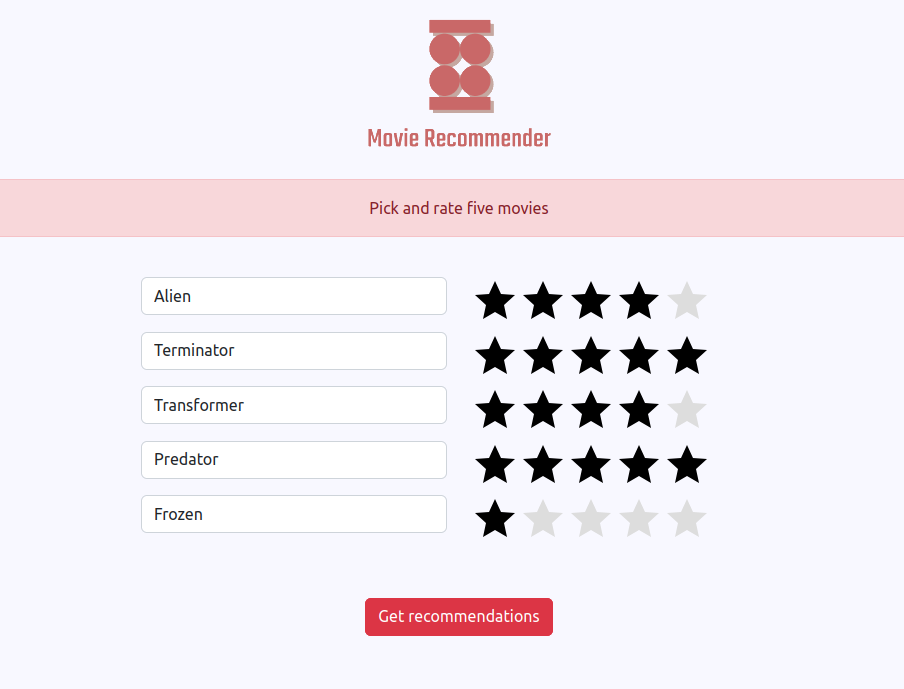
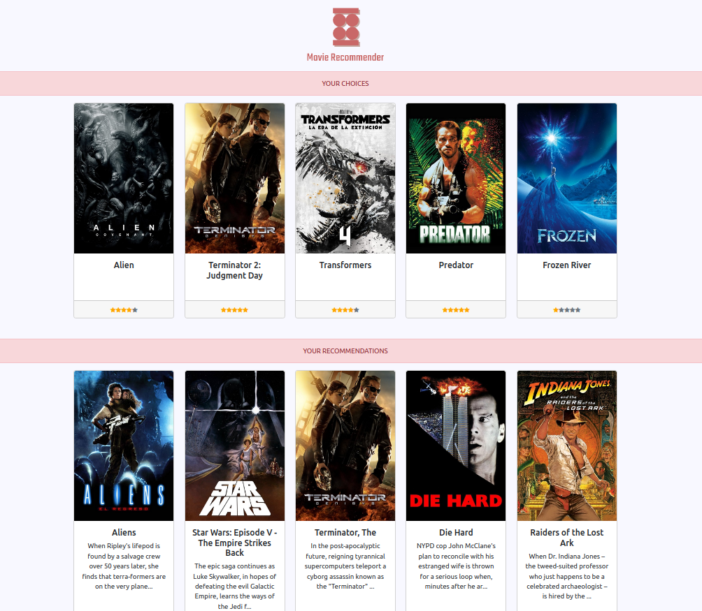

# *Movie Recommender*
## KMeans, Flask, Heroku, theFuzz and Sprase Matrices

This project was completed in week 10 of the Spiced Data Science Bootcamp in Berlin. The goal was to create a Movie Recommender Webservice running on a Heroku Server.

The front-end was build with Flask and Bootstrap. It uses thefuzz and tmdb libraries to pull movie posters from the TMDB api. 

Predictions are made with a KMeans Model, trained on a database of movies and ratings.

The model finds 10 similar users and shows their top five rated movies.

